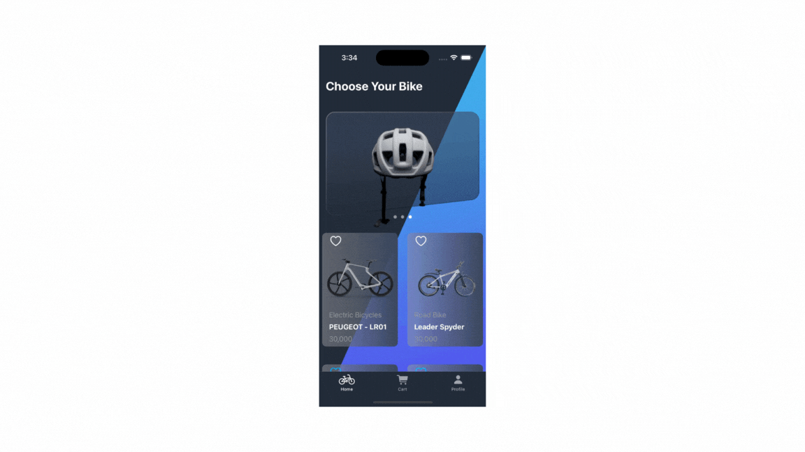

# CycliqHub 🚲
CycliqHub App is a SwiftUI-based iOS application designed to provide users with a seamless and visually appealing experience for shopping bicycles. The app features animations, utilizes AppStorage for saving user details, and enhances the user interface with gradient backgrounds.
## Key Features
- **Animated Interactions:** Enjoy a visually engaging experience with animated interactions throughout the app.

- **User Details Storage:** User details are securely stored using SwiftUI's AppStorage for a personalized experience.

- **Gradient Backgrounds:** The app is designed with beautiful gradient backgrounds, enhancing the overall aesthetic appeal.

## Demo🔥


## UI controls
- Scrollview
- Navigation View
- VStack, HStack, Zstack
- List
- Tabbar
- Image 
- Text
- Alert
- TextField 
- Buttons (Action & Navigation)

## Installation
To install and run CycliqHub, follow these steps:

1. Clone the repository to your local machine:
```bash
git clone https://github.com/NirmalsinhRathod/CycliqHub.git
```
2. Open the project in Xcode.

3. Build and run the project on your desired iOS device or simulator.

## Author

- [@NirmalsinhRathod](https://github.com/NirmalsinhRathod) 🧑🏻‍💻
